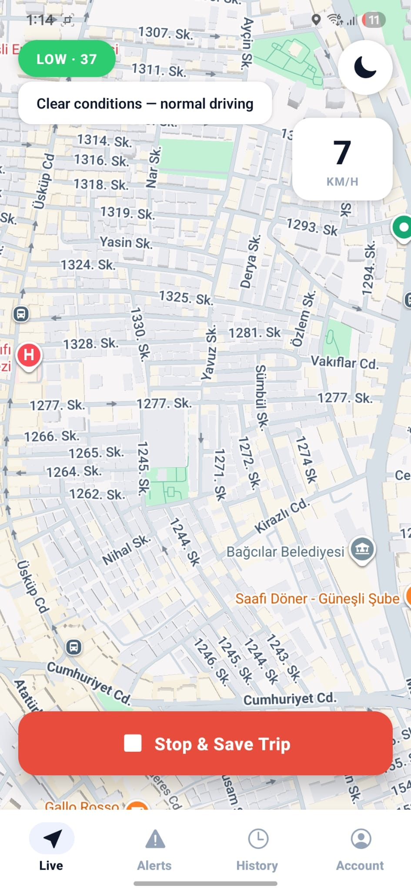
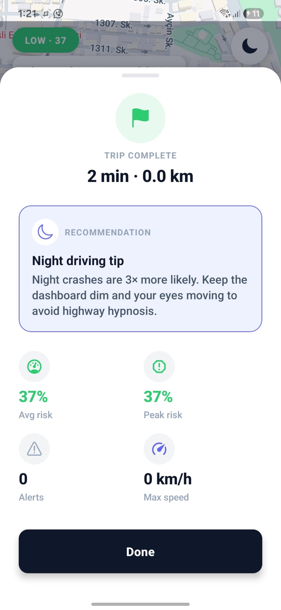

# Predictive Road Warning System / RoadSense

| Live Drive | Trip summary (completion) |
|:----------:|:-------------------------:|
|  |  |

RoadSense is a preventive road-risk assistant: a mobile client records where and when you drive, a FastAPI backend fuses live weather, local historical accident density from MongoDB, and a trained regression model, then returns a risk score and short text the app can show or read aloud.

The stack is **Expo (React Native)** for the app, **FastAPI + Motor** for the API, **MongoDB Atlas** for users, UK-sourced accident records, and saved trips, and **scikit-learn** (Random Forest) for the core model. The historical accident layer is imported from a public **UK Road Safety** extract; live weather comes from **OpenWeatherMap**. Treating Turkey (or any region) as “fully calibrated” by that UK spatial layer is a known limitation and should be documented in any formal write-up.

---

## Repository layout

```
RoadWarningSystem/
├── App.js, index.js          # Expo entry, navigation shell
├── api/                      # HTTP helpers (JWT, base URL from env)
├── auth/                     # Auth context, SecureStore-backed session
├── screens/                  # Live Drive, Alerts, History, Account, Login
├── components/               # Modals, map trail, heatmap, etc.
├── theme/                    # Shared colors and spacing
├── backend/
│   ├── app/                  # FastAPI: auth, risk, history, db
│   ├── data/                 # Dataset, processed CSV, road_risk_model.pkl
│   ├── scripts/              # preprocess_uk_accidents.py, train_road_risk_model.py
│   ├── requirements.txt
│   └── .env.example
└── package.json
```

More detail on the HTTP API and collections lives in `backend/README.md`.

---

## Prerequisites

- **Node.js** 18+ and **npm** (or **yarn**) for the Expo app.
- **Python** 3.12 recommended for the backend (pinned ML wheels in `requirements.txt` target 3.12; other versions may build from source).
- A **MongoDB Atlas** cluster and connection string.
- **OpenWeatherMap** API key for `/api/predict-risk`.
- Optional: **UK accident** file (`Accident_Information.csv.xlsx` or equivalent) under `backend/data/` if you want the first-run import; prebuilt `road_risk_model.pkl` for inference.

---

## Backend

### Setup

```bash
cd backend
python -m venv .venv
source .venv/bin/activate   # Windows: .venv\Scripts\activate
pip install -r requirements.txt
cp .env.example .env
```

Edit `.env`: set `MONGODB_URI`, a long random `JWT_SECRET`, `OPENWEATHERMAP_API_KEY`, and paths if your files are not in the default locations. See `backend/.env.example` for the full list.

Place `data/road_risk_model.pkl` on disk (train it with the provided scripts or copy an existing artifact). On first startup, if `accident_history` is empty and `IMPORT_ACCIDENTS_ON_STARTUP=true`, the server streams the dataset from `ACCIDENTS_DATASET_PATH` into MongoDB; this can take a while on a large file.

### Run

```bash
uvicorn app.main:app --reload --host 0.0.0.0 --port 8000
```

Open `http://localhost:8000/docs` for interactive OpenAPI documentation.

### Main routes (short)

| Method | Path | Auth | Purpose |
|--------|------|------|--------|
| POST | `/api/auth/register` | — | Create user |
| POST | `/api/auth/login` | — | JWT |
| GET | `/api/auth/me` | Bearer | Profile |
| POST | `/api/predict-risk` | Bearer | GPS + speed + heading; weather + `h_loc` + model |
| GET/POST… | `/api/history/trips` | Bearer | List, create, fetch, delete trips |
| GET | `/health` | — | DB and model load status |

The app uses **`POST /api/predict-risk`** for live driving. Additional risk and debug routes may exist under `/api/risk/*` (see `backend/README.md`).

### Model training (optional)

From `backend/` with the venv active and the raw dataset in place:

```bash
python scripts/preprocess_uk_accidents.py
python scripts/train_road_risk_model.py
```

This regenerates `data/uk_accidents_processed.csv` and `data/road_risk_model.pkl`. Training is slow on very large sources; use a machine with enough RAM and disk.

---

## Mobile app (Expo)

### Setup

```bash
cd RoadWarningSystem   # repo root containing package.json
npm install
```

```bash
EXPO_PUBLIC_API_URL=http://192.168.1.10:8000 npx expo start
```

### Run

```bash
npx expo start
```

Then press `i` / `a` / `w` for iOS simulator, Android emulator, or web. Full **map and GPS** behaviour is only meaningful on **iOS** or **Android**; web is useful for auth and non-map screens.

---
